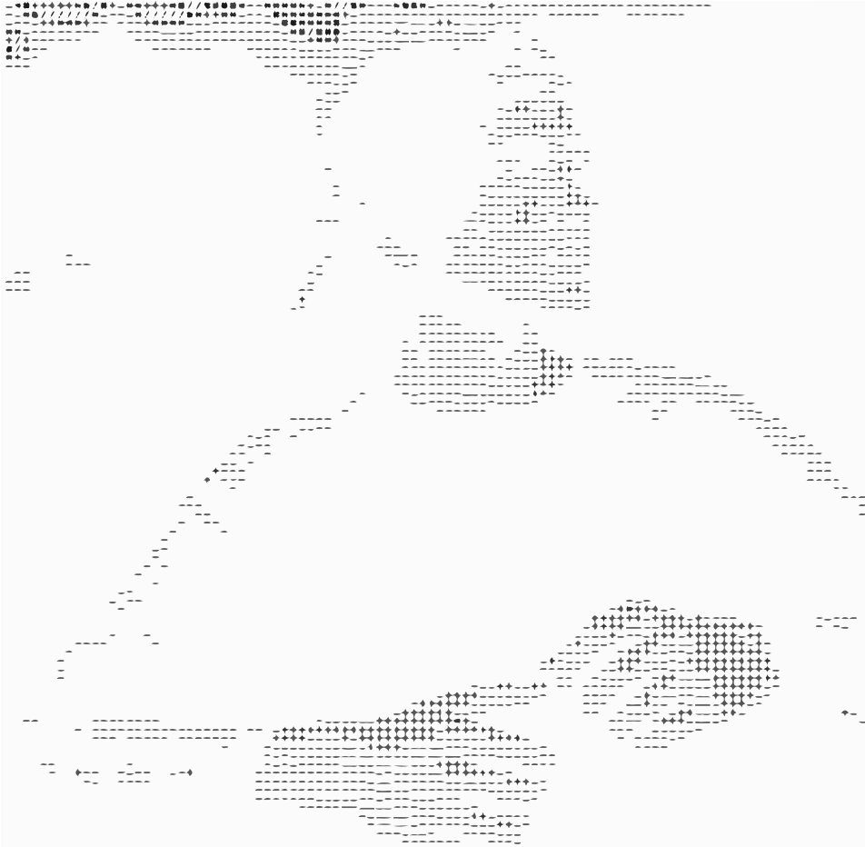

## Hello there
<a href="https://github.com/i2mWasil/i2mWasil">
  <picture>
    <source media="(prefers-color-scheme: dark)" srcset="dark_mode.svg">
    
  </picture>
</a>

---

### 🧑‍💻 About Me

- 🎓 I'm a 3rd year student at Indian Insititute of Information Technology, Allahabad (IIITA)
- 💻 Passionate about building software, exploring tech and contributing to open-source
- 🚀 Current interests: **Blockchain**, **Cybersecurity**, **App Development**
- 📫 How to reach me: 
  
- 🌱 Currently learning: `Cryptography`, `Blockchain`, `Flutter`

---

### 🔧 Technologies & Tools

---

### 📈 GitHub Stats & Activity

  
  

  
  
  

---

### 📊 Contribution Graph

---

### ✨ Featured Projects

- 🔗 [ProBono](https://github.com/i2mWasil/eudia-hackathon-frontend) - ProBono is a web platform that exposes the real “privacy cost” of digital services.
- 🔗 [obSecure](https://github.com/i2mWasil/obSecure) - obSecure is a cross-platform end-to-end encrypted messaging application
- 🔗 [Lencho](https://github.com/i2mWasil/lencho) - Lencho is a modern farming assistant app built for farmers and agricultural enthusiasts
- 🔗 [ChordCraft](https://github.com/orange-carpet-org/chord-craft) - ChordCraft is an interactive app designed to help users learn and practice musical instruments.

---

### 💬 Let's Connect!

  
  
  

